# No-Code Architects Toolkit

The No-Code Architects Toolkit is a robust media processing API built with Flask, providing services like audio conversion, video combination, transcription, captioning, and Google Drive upload integration. This toolkit is designed for easy deployment via Docker and Google Cloud Platform (GCP) and allows effortless media manipulation.

---

## Features

- **Convert Media to MP3**: Convert various media files to MP3 format.
- **Combine Multiple Videos**: Merge multiple videos into one seamless file.
- **Transcribe Media**: Transcribe audio directly from media files.
- **Add Captions to Videos**: Insert captions to videos using SRT or ASS files.
- **Upload Files to Google Drive**: Securely upload files to a Google Drive folder.
- **Audio Mixing**: Integrate audio files with video for a fully synced experience.
- **Keyframe Extraction**: Extract keyframes from video files for thumbnails or previews.

---

## Prerequisites

- **Google Cloud Platform (GCP) Account**: For using Google Cloud Storage and Google Drive.
- **Docker**: For running the application locally or in any containerized environment.
- **Google Cloud SDK**: For managing GCP resources, downloadable from [Google Cloud SDK](https://cloud.google.com/sdk).

---

## Environment Variables

The following environment variables are necessary for the application to function as intended:

- `API_KEY`: A secure API key for authenticating requests.
- `GCP_SA_CREDENTIALS`: Service account credentials in JSON format for Google Cloud Platform access.
- `GDRIVE_USER`: The Google Drive user email associated with the service.
- `GCP_BUCKET_NAME`: The name of the Google Cloud Storage bucket used for storage.
- `GDRIVE_FOLDER_ID`: The Google Drive folder ID where files will be uploaded.

---

## Docker Build and Run

1. **Build the Docker Image**:

   ```bash
   docker build -t media-processing-api .
   ```

2. **Run the Docker Container**:

   ```bash
   docker run -d -p 8080:8080 \
     -e API_KEY=your_api_key \
     -e GCP_SA_CREDENTIALS='{"your":"service_account_json"}' \
     -e GDRIVE_USER=your_gdrive_user@example.com \
     -e GCP_BUCKET_NAME=your_gcs_bucket_name \
     media-processing-api
   ```

---

## API Documentation

The following API endpoints are available. Detailed documentation for each endpoint is in the `docs` folder:

1. **[Transcribe Media v1](docs/v1/transcribe-media.md)** - Transcribes media audio.
2. **[FFmpeg Compose v1](docs/v1/ffmpeg-compose.md)** - Custom media composition using FFmpeg.
3. **[Authenticate](docs/authenticate.md)** - Verifies API key for access.
4. **[Media to MP3](docs/media-to-mp3.md)** - Converts media files to MP3.
5. **[Transcribe Media](docs/transcribe-media.md)** - Transcribes media audio.
6. **[Image to Video](docs/image-to-video.md)** - Converts images into a video.
7. **[Caption Video](docs/caption-video.md)** - Adds captions to videos.
8. **[Combine Videos](docs/combine-videos.md)** - Merges multiple videos.
9. **[Audio Mixing](docs/audio-mixing.md)** - Mixes audio into video files.
10. **[Google Drive Upload](docs/gdrive-upload.md)** - Uploads files to Google Drive.
11. **[Extract Keyframes](docs/extract-keyframes.md)** - Extracts video keyframes.

Refer to each linked file for comprehensive examples, request/response structures, and usage notes.

---

## Deploying on Google Cloud Platform (GCP)

### Prerequisites

1. **Google Cloud Project Setup**:
   - Log in to [Google Cloud Console](https://console.cloud.google.com/) and create a new project.
   - Enable required APIs:
     - **Cloud Storage API**
     - **Cloud Storage JSON API**
     - **Cloud Run Admin API**

   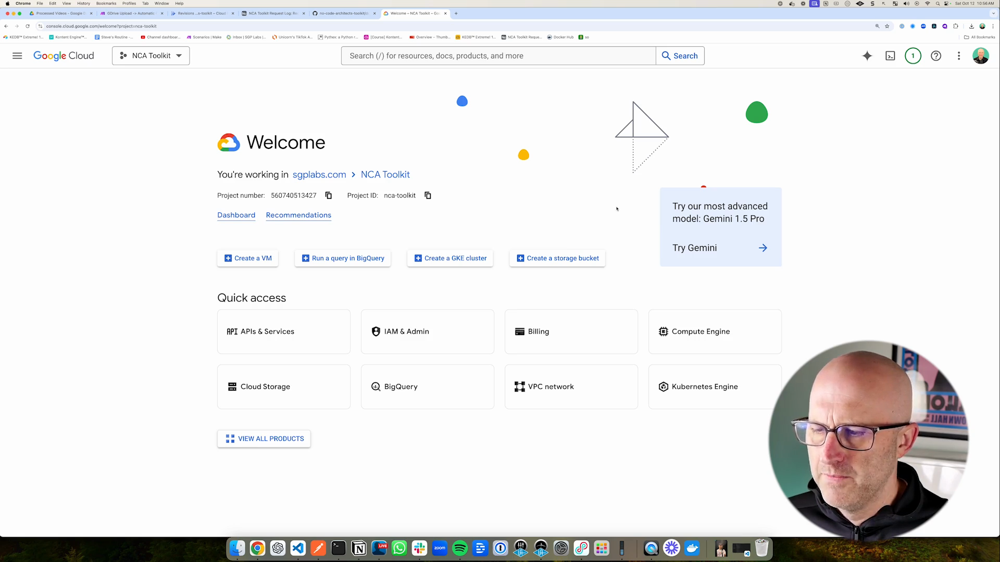
   *Figure 1: Initiating a new project in Google Cloud Console.*

2. **Enable Required APIs and Services**:
   - **Navigate to APIs & Services**:
     - Click on **Menu** (☰) > **APIs & Services** > **Library**.
   
   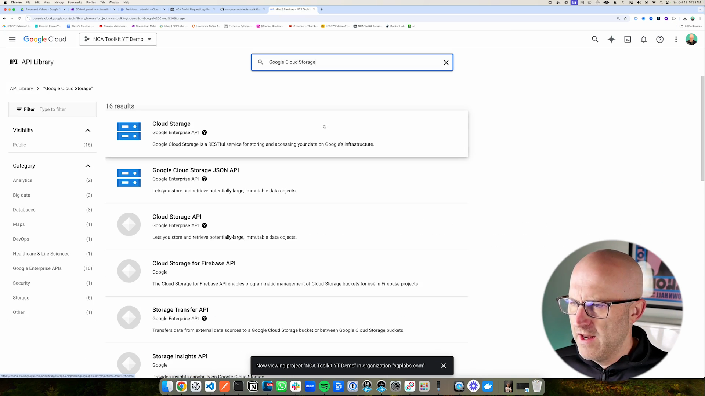
   *Figure 2: Enabling Cloud Storage APIs in the Google Cloud Console.*

   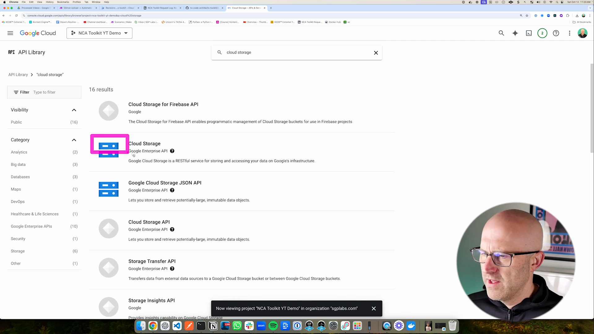
   *Figure 3: Enabling the Cloud Run Admin API.*

3. **Service Account Setup**:
   - **Navigate to Service Accounts**:
     - Go to **Menu** (☰) > **IAM & Admin** > **Service Accounts**.

   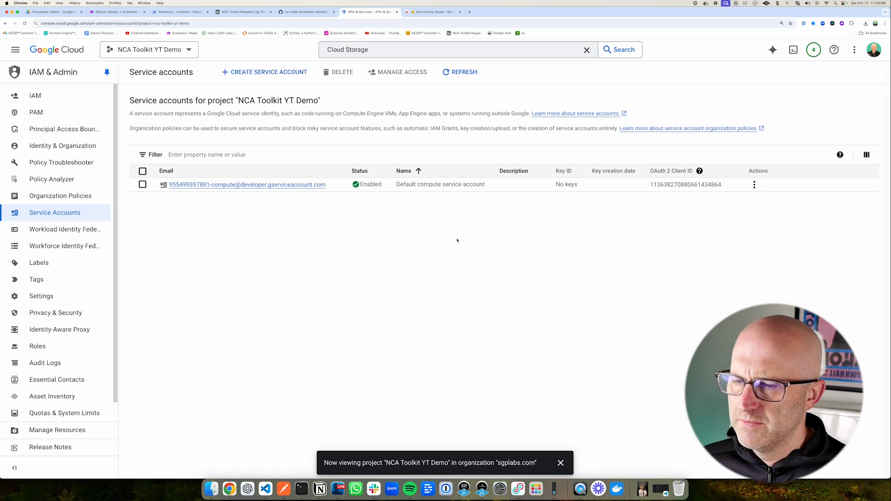
   *Figure 4: Accessing IAM & Admin Service Accounts.*

   - **Create a New Service Account**:
     - Click **+ CREATE SERVICE ACCOUNT**.
     - Name your service account (e.g., `nca-toolkit-sa`).
     - Click **Create and Continue**.

   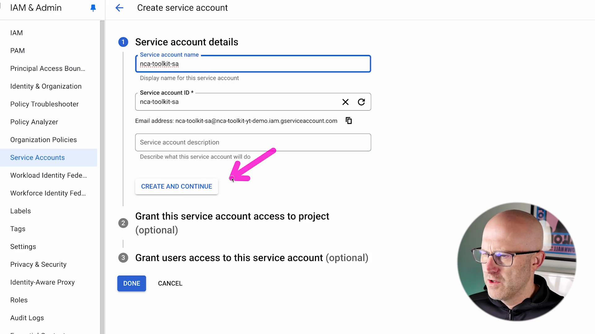
   *Figure 5: Creating a new service account.*

   - **Assign Roles to the Service Account**:
     - **Storage Admin**:
       - Start typing **"Storage Admin"** and select it.
     - **Viewer**:
       - Add another role and select **Viewer**.
     - Click **Continue**, then **Done**.

   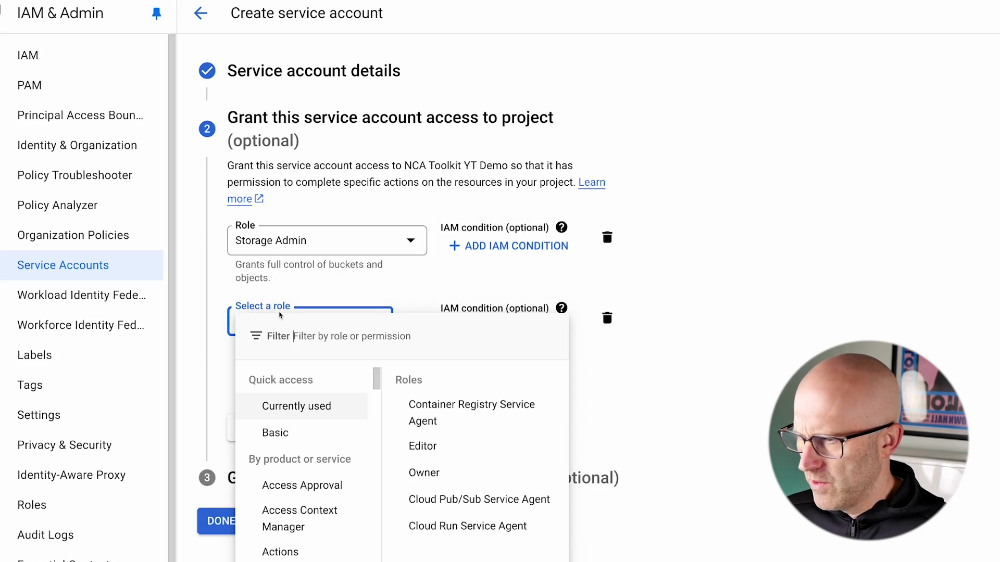
   *Figure 6: Assigning Storage Admin and Viewer roles.*

   - **Generate and Download a JSON Key File**:
     - Click on your newly created service account.
     - Go to the **Keys** tab.
     - Click **ADD KEY** > **Create new key**.
     - Select **JSON** as the key type.
     - Click **Create**.
     - A JSON key file will be downloaded to your computer. **Keep this file secure**.

   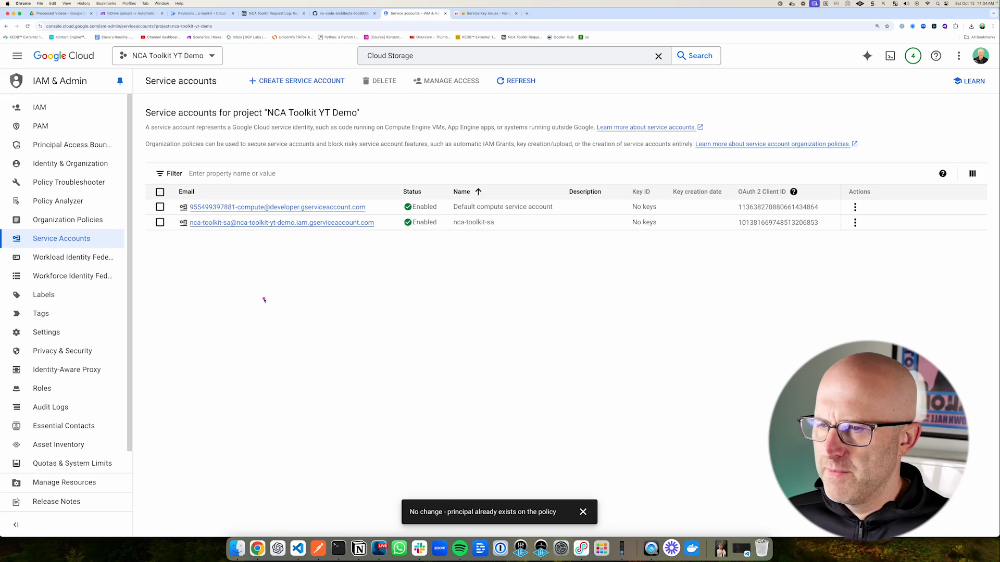
   *Figure 7: Generating and downloading the JSON key file.*

   > **Note**: If you encounter the error **"Key creation is not allowed on this service account"** when attempting to create and download the key, this is due to an organization policy constraint `iam.disableServiceAccountKeyCreation` enforced in your organization. To resolve this issue, you can either create the service account using a personal Gmail account or follow the steps below to allow key creation for your project.

   **Allow Service Account Key Creation for Your Project**

   - **Assign the Organization Policy Administrator Role**:
     1. Sign in to the [Google Cloud Console](https://console.cloud.google.com/).
     2. From the project selector, select your main organization.
     3. Navigate to **IAM & Admin** > **IAM**.
     4. Click **+ GRANT ACCESS**.
     5. In the **New principals** field, enter your email address.
     6. In **Select a role**, search for and select **Organization Policy Administrator**.
     7. Click **Save**.

   - **Manage Organization Policy for Your Project**:
     1. From the project selector, select your project (e.g., `nca-toolkit-deployment`).
     2. Navigate to **IAM & Admin** > **Organization policies**.
     3. In the **Filter** field, enter `Disable service account key creation`.
     4. Select the **Disable service account key creation** constraint from the results.
     5. Click **Edit** to modify the policy.
     6. Choose **Customize** to override the inherited policy.
     7. Add a rule with **Enforcement** set to **Off**.
     8. Click **Save** to apply the changes.

   - **Retry Key Creation**:
     - Return to **IAM & Admin** > **Service Accounts**.
     - Select your service account.
     - Go to the **Keys** tab.
     - Click **ADD KEY** > **Create new key**.
     - Select **JSON** as the key type and click **Create**.
     - The key should now be generated and downloaded successfully.

     If the issue persists after following these steps, please consult your organization's administrator or refer to the [Google Cloud documentation on managing service account keys](https://cloud.google.com/iam/docs/creating-managing-service-account-keys).

   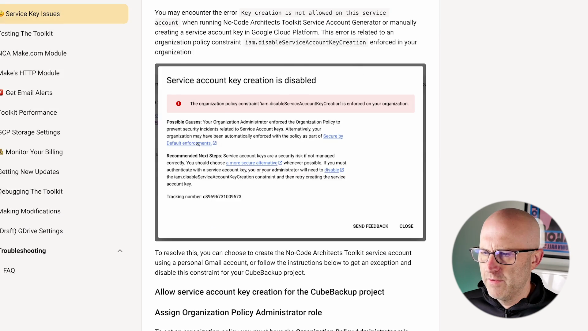
   *Figure 8: Handling the key creation error.*

4. **Configure Google Drive Upload Settings**

   To enable Google Drive integration, follow these steps to set up domain-wide delegation:

   1. **Navigate to Service Accounts**:
      - In the Google Cloud Console, go to **IAM & Admin** > **Service Accounts**.

   2. **Select Your Service Account**:
      - Click on the service account you created earlier (e.g., `nca-toolkit-sa`).

   3. **Copy the Unique ID**:
      - In the service account details, copy the **Unique ID**.

   4. **Create a Second JSON Key File**:
      - Click the **Keys** tab.
      - Click **ADD KEY** > **Create new key** > **JSON** > **CREATE**.
      - This will download a second JSON key file to your computer.

   5. **Extract the Client ID**:
      - Open the downloaded JSON key file in a text editor.
      - Locate and copy the `client_id` value.

   6. **Access Google Workspace Admin Console**:
      - Go to [admin.google.com](https://admin.google.com/) and sign in with your administrator account.

   7. **Navigate to API Controls**:
      - In the Admin console, go to **Security** > **Access and data control** > **API controls**.

   8. **Manage Domain-Wide Delegation**:
      - Click on **Manage Domain Wide Delegation**.

   9. **Add a New Delegation**:
      - Click **Add new**.
      - In **Client ID**, paste the `client_id` you copied earlier.
      - In **OAuth Scopes**, enter:
        ```
        https://www.googleapis.com/auth/drive
        ```
      - Click **Authorize**.
   > **Important**: Ensure that the service account has the necessary permissions to access and manage Google Drive on behalf of users in your domain.

5. **Create a Cloud Storage Bucket**

   - **Navigate to Cloud Storage**:
     - Go to **Menu** (☰) > **Cloud Storage** > **Buckets**.

   - **Create a New Bucket**:
     - Click **+ CREATE BUCKET**.
     - Enter a unique name for your bucket (e.g., `nca-toolkit-bucket-<your-unique-id>`).
     - Click **Continue** through the default settings until **Choose how to control access to objects**.
     - **Access Control**:
       - Select **Uniform**.
     - **Public Access Prevention**:
       - Turn **Off** the **"Enforce public access prevention"** toggle to allow public access.
     - Click **Create**.

   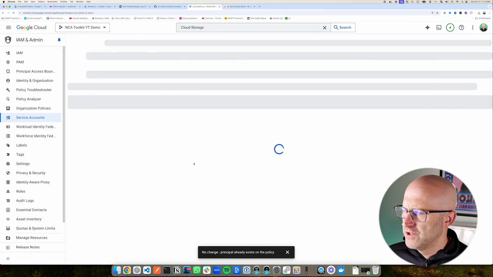
   *Figure 10: Creating a new Cloud Storage bucket.*

   - **Set Bucket Permissions**:
     - After the bucket is created, go to the **Permissions** tab.
     - Click **+ GRANT ACCESS**.
     - **New Principals**:
       - Enter **allUsers**.
     - **Role**:
       - Select **Storage Object Viewer**.
     - Click **Save**.
     - Acknowledge the warning about granting public access.

   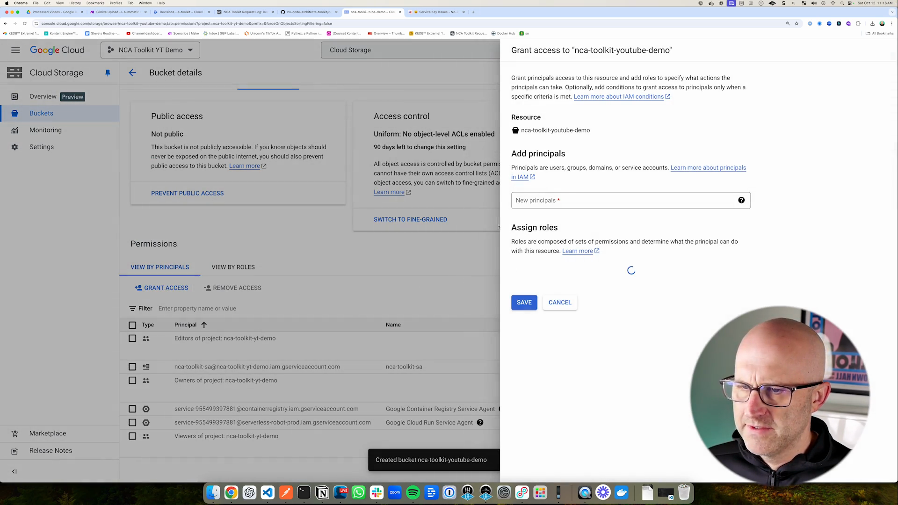
   *Figure 11: Granting allUsers the Storage Object Viewer role.*

---

## Full Deployment on Google Cloud Run

Follow these detailed steps to deploy the No-Code Architects Toolkit on Google Cloud Run.

### Step-by-Step Deployment

#### 1. Set Up Your Google Cloud Project

- **Create a New Project**:
  - Go to [Google Cloud Console](https://console.cloud.google.com/).
  - Click on the project selector at the top and select **New Project**.
  - Name your project (e.g., `nca-toolkit-deployment`) and select your organization if applicable.
  - Click **Create**.
  - Once the project is created, select it from the project selector.

#### 2. Enable Required APIs and Services

- **Navigate to APIs & Services**:
  - Click on **Menu** (☰) > **APIs & Services** > **Library**.
- **Enable the Following APIs**:
  - **Cloud Storage API**:
    - Search for **"Cloud Storage"**.
    - Enable both **Cloud Storage** and **Cloud Storage JSON API**.
  - **Cloud Run API**:
    - Search for **"Cloud Run"**.
    - Enable **Cloud Run Admin API**.

#### 3. Create a Service Account

- **Navigate to Service Accounts**:
  - Go to **Menu** (☰) > **IAM & Admin** > **Service Accounts**.
- **Create a New Service Account**:
  - Click **+ CREATE SERVICE ACCOUNT**.
  - Name your service account (e.g., `nca-toolkit-sa`).
  - Click **Create and Continue**.
- **Assign Roles to the Service Account**:
  - **Storage Admin**:
    - Start typing **"Storage Admin"** and select it.
  - **Viewer**:
    - Add another role and select **Viewer**.
  - Click **Continue**, then **Done**.
- **Generate and Download a Key File**:
  - Click on your newly created service account.
  - Go to the **Keys** tab.
  - Click **ADD KEY** > **Create new key**.
  - Select **JSON** as the key type.
  - Click **Create**.
  - A JSON key file will be downloaded to your computer. **Keep this file secure**.

  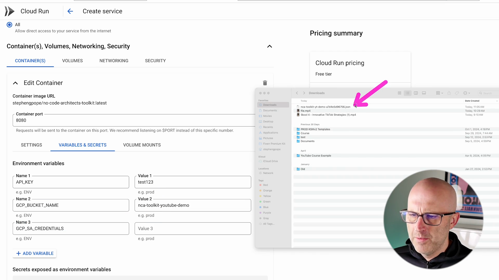
  *Figure 12: Pasting the JSON service account credentials.*

  > **Note**: If you encounter the error **"Key creation is not allowed on this service account"**, please refer to the steps outlined in the [Prerequisites](#prerequisites) section to enable key creation for your project.

#### 4. Configure Google Drive Upload Settings

*Refer to the [Configure Google Drive Upload Settings](#configure-google-drive-upload-settings) section above.*

#### 5. Create a Cloud Storage Bucket

*Refer to the [Create a Cloud Storage Bucket](#create-a-cloud-storage-bucket) section above.*

#### 6. Deploy the Cloud Run Service

- **Navigate to Cloud Run**:
  - Go to **Menu** (☰) > **Cloud Run**.
- **Create a New Service**:
  - Click **+ CREATE SERVICE**.
  - **Service Settings**:
    - **Container Image URL**:
      - Enter `stephengpope/no-code-architects-toolkit:v1.0.1`.
    - **Service Name**:
      - Use the default or specify a name.
    - **Region**:
      - Select your preferred region.
  - Click **Next** to configure the service.

  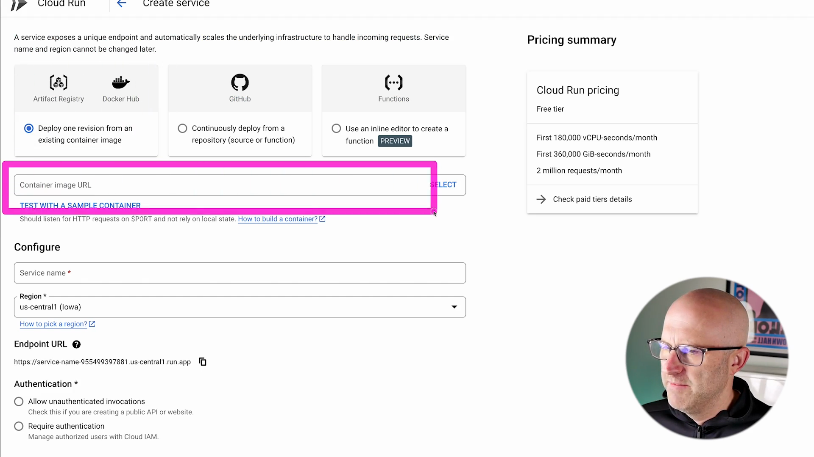
  *Figure 13: Deploying a new service on Cloud Run.*

- **Configure Authentication and Permissions**:
  - **Authentication**:
    - Select **Allow unauthenticated invocations**.

- **Set CPU and Memory Allocation**:
  - Click **Show advanced settings**.
  - Under **CPU Allocation and Pricing**:
    - Select **CPU is always allocated**.
  - **Memory**:
    - Set to **16 GiB** for faster processing (adjust based on your needs).
  - **CPU**:
    - Set the **Minimum number of CPUs** to **4**.

- **Set Environment Variables**:
  - Under **Variables & Secrets** > **Environment variables**, add the following:
    - **`API_KEY`**:
      - Set to a secure value (e.g., `test123` for testing).
    - **`GCP_BUCKET_NAME`**:
      - Enter the name of your Cloud Storage bucket.
    - **`GCP_SA_CREDENTIALS`**:
      - Paste the entire JSON content from your service account key file.
    - **`GDRIVE_USER`**:
      - Enter the Google Drive user email associated with the service.
    - **`GDRIVE_FOLDER_ID`**:
      - Enter the Google Drive folder ID where files will be uploaded.

- **Additional Settings**:
  - **Request Timeout**:
    - Leave at default (300 seconds) or adjust as needed.
  - **Maximum Concurrent Requests**:
    - Set to **1** for initial testing.
  - **Execution Environment**:
    - Select **Second Generation**.

- **Deploy the Service**:
  - Review all settings.
  - Click **Create**.
  - Wait for the deployment to complete.

  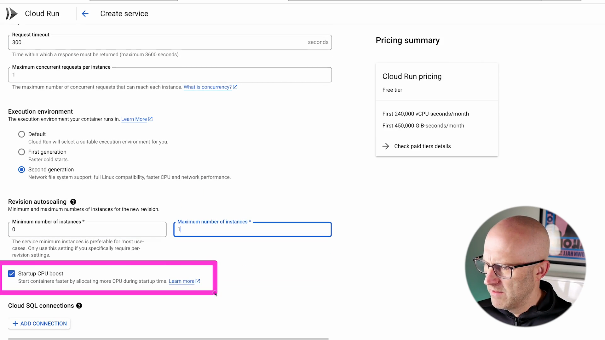
  *Figure 14: Completing the deployment and verifying the green check mark.*

#### 7. Test the Deployment

- **Retrieve the Service URL**:
  - After deployment, your service URL will be displayed (e.g., `https://<service-name>-<hash>-<region>.a.run.app`).

- **Test Using Postman or Similar Tool**:
  - **Set Up Postman**:
    - Create a new **POST** request.
    - Set the URL to your service URL plus the endpoint (e.g., `https://<service-url>/transcribe-media`).
  - **Headers**:
    - Add a header `X-API-Key` with the value you set (`test123`).
  - **Body**:
    - Select **raw** and **JSON**.
    - Enter a JSON payload, for example:
      ```json
      {
        "media_url": "https://your-media-url.com/video.mp4",
        "webhook_url": "https://your-webhook-url.com"
      }
      ```
  - **Send the Request**:
    - Click **Send** and wait for the response.

  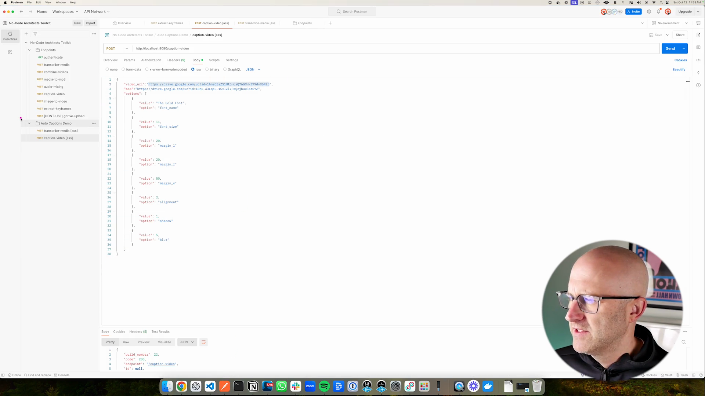
  *Figure 15: Using Postman to test the API endpoints.*

  - **Verify the Response**:
    - A successful response should indicate that the media is being processed.

  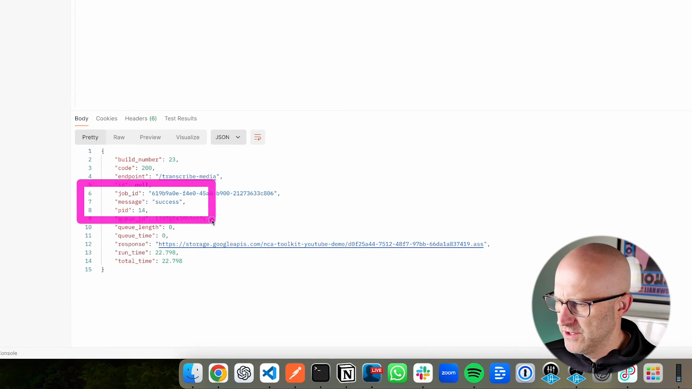
  *Figure 16: Receiving a successful response in Postman.*

- **Test the Output**:
  - Check your Cloud Storage bucket for the output files.
  - Ensure that the files are accessible and properly processed.

    
    *Figure 17: Replacing localhost with the actual service URL in Postman.*

    > **Note**: If you encounter permissions issues accessing the files, revisit the bucket permissions in step 5.

---

## Testing the Application

### Authenticate Endpoint

- **Test the `/authenticate` Endpoint**:

  ```bash
  curl -X POST https://<your-service-url>/authenticate \
    -H "X-API-Key: test123"
  ```

- **Expected Response**:
  - A success message confirming authentication.

### Transcribe Media

- **Test the `/transcribe-media` Endpoint**:

  ```bash
  curl -X POST https://<your-service-url>/transcribe-media \
    -H "X-API-Key: test123" \
    -H "Content-Type: application/json" \
    -d '{"media_url": "https://your-media-url.com/video.mp4"}'
  ```

- **Expected Response**:
  - A message indicating that transcription has started.

### Accessing Transcribed Files

- **Retrieve the Output**:
  - The transcribed files will be stored in your Cloud Storage bucket.
  - Access the files via the Cloud Console or directly using the file URL.

---

## Monitoring and Cleanup

### Monitoring

- **Cloud Logging**:
  - Access logs via **Menu** (☰) > **Logging** > **Logs Explorer**.
  - Filter logs by resource type **Cloud Run Revision**.
- **Cloud Run Metrics**:
  - Monitor CPU and memory usage under **Cloud Run** > **Your Service** > **Metrics**.

### Cleanup

To avoid unnecessary costs:

- **Delete the Cloud Run Service**:
  - In **Cloud Run**, select your service and click **Delete**.
- **Delete the Cloud Storage Bucket**:
  - In **Cloud Storage**, select your bucket and click **Delete**.
- **Remove Service Account Keys**:
  - Go to **IAM & Admin** > **Service Accounts**.
  - Select your service account, go to the **Keys** tab, and delete the key.
- **Delete the Project** (if no longer needed):
  - In the project selector, click **Manage all projects**.
  - Select your project and click **Delete**.

---

## License

This project is licensed under the [MIT License](LICENSE).
